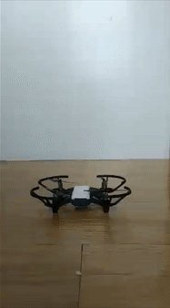

## About

This package provides a Dart interface to Tello drones.

## Getting started

* Install this package on [pub.dev](https://pub.dev/packages/ryze_tello).
* Write a dart script to control your Tello.
* Turn on your Tello.
* Run your script and watch your Tello fly through the air!

<table>
  <tr>
    <td></td>
    <td></td>
  </tr>
</table>

## Usage

Here's some sample code that shows how you can make a Tello takeoff,
hover in the air for 5 seconds, and then land. 

An important thing to note here is that **tello.disconnect()** must be called 
to properly dispose of the sockets that connect to the tello.

```dart
import 'package:ryze_tello/ryze_tello.dart';

void main() async {
  late final Tello tello;

  try {
    /* Initializing */
    tello = await Tello.tello();

    /* Flying Around */
    await tello.takeoff();

    await Future.delayed(const Duration(seconds: 5));

    await tello.land();
  } finally {
    /* Cleanup & Disconnection */
    tello
        .disconnect(); // IMPORTANT: Must be called to properly dispose of the sockets that connect to the tello.
  }
}
```

You can find a more comprehensive example [here](example/ryze_tello_example.dart).

## Documentation

The documentation for this project is in its [pub.dev](https://pub.dev/packages/ryze_tello) page.
[Here's a quick link to it.](https://pub.dev/documentation/ryze_tello/latest/ryze_tello/ryze_tello-library.html)

## Additional information

This package is a wrapper around the Tello's SDK.
You can find more information about the SDK [here](https://dl-cdn.ryzerobotics.com/downloads/tello/20180910/Tello%20SDK%20Documentation%20EN_1.3.pdf).
